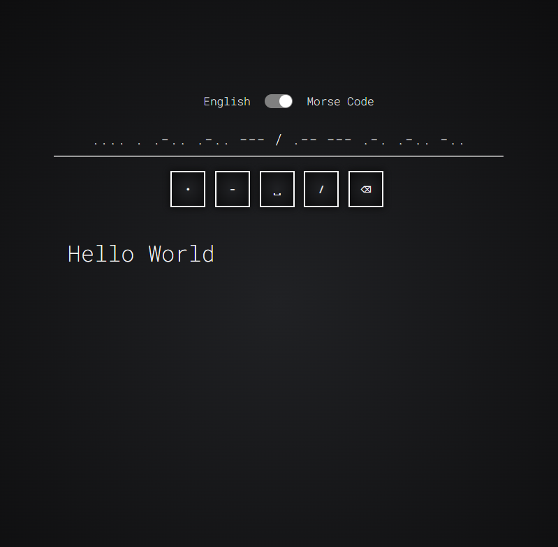

# Morse code translator

Live website https://dyancic.github.io/morse-code-translator/

 

# Task breakdown

This task will require you to create a web page Morse Code translator.
The User Interface will have to look good but should remain simple

### MVP

-   Create a user interface that allows the user to either input some English text or some Morse Code
-   Create JS functions that would allow the user to translate english <-> morse.
-   Make sure to handle spaces properly
-   Keep your pure functions separated from the JS DOM interaction code.
-   Add unit tests for each of the pure function that your translator uses (each function should have at least 4 tests, think of edge cases, wrong inputs, etc ...)

 

# Design / Features

As required by the MVP I went with a simple design with a single switch to toggle between translation direction. When inputting morse buttons fade in and sound plays for dashes and dots. Keyboard presses also activate the button active effects. The translations update dynamically as you type and switch inputs and outputs when the switch is pressed.

When view width is reduced to handheld size the morse buttons switch to the bottom of the screen just to be closer to the thumb zone.

 

# Approach

The main issue I ran into when coding this project was if the user inputs characters that weren't in the key. My work around for this was using regex to filter the users input dynamically.

 

# Future changes

-   Play button for morse code translations.
-   Copy to clipboard.
